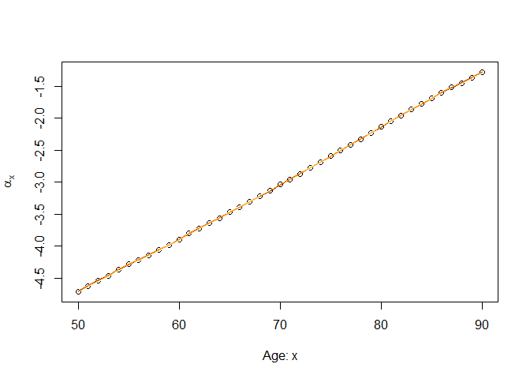
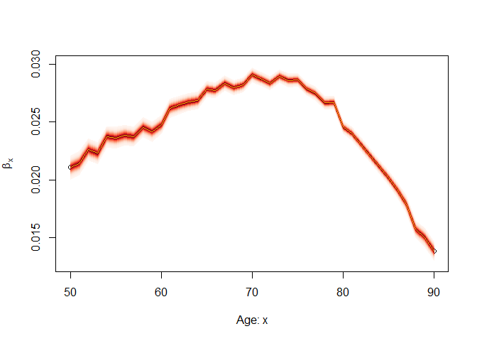
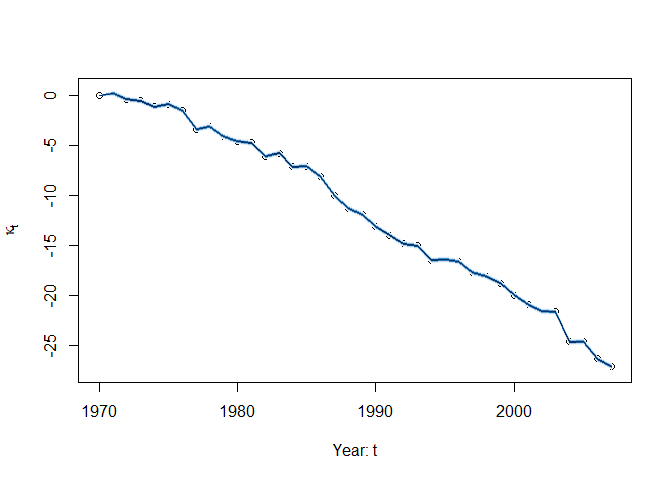
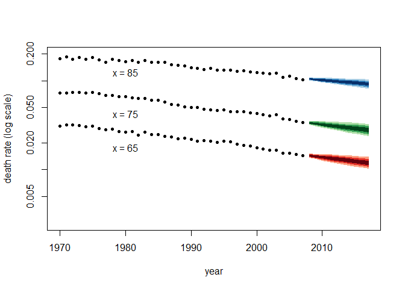

Bayesian Lee Carter with Stan
================

Introduction
------------

This vignette explains how to estimate the Lee-Carter model using the `lc_stan` function in the **StanMoMo** package.

First, after installing the package, you have to load the package via:

``` r
library(StanMoMo)
```

For illustration, the package already includes the object `FRMaleData` containing deaths (`FRMaleData$Dxt`) and central exposures (`FRMaleData$Ext`) for French males for the period 1816-2017 and for ages 0-100. In our example, we concentrated on ages 50-90 and the period 1970-2017. This can be obtained via:

``` r
ages.fit<-50:90
years.fit<-1970:2007
deathFR<-FRMaleData$Dxt[formatC(ages.fit),formatC(years.fit)]
exposureFR<-FRMaleData$Ext[formatC(ages.fit),formatC(years.fit)]
```

As a reminder, the Lee-Carter model assumes that mortality dynamics are given by

\\
\log \mu_{xt}&=\alpha_x+\beta_x \kappa_t
\end{aligned}
")

 To ensure identifiability of the model, we assume that


Moreover, we make the standard assumption that the period parameter follows a random walk with drift:


")

Bayesian Estimation
-------------------

Now, the model can be estimated and forecast for the next 10 years by a simple call to the `lc_stan` function:

``` r
fitLC=lc_stan(death = deathFR,exposure=exposureFR, forecast = 10, family = "poisson",cores=4)
```

By default, Stan samples four Markov chains with 2000 iterations with 1000 warmup iterations for each chain (hence, 4000 draws in total). The output is an object of class `stanfit` (cf. the **rstan** package) which contains the posterior draws of each parameter, the posterior log likelihoods as well as the mortality forecasts.

We can then obtain an overview of the sampling for each parameter by calling the `print` function. For instance, different quantiles for , for , based on the 4000 draws can be obtained via

``` r
print(fitLC,pars = "a")
```

    ## Inference for Stan model: leecarter.
    ## 4 chains, each with iter=2000; warmup=1000; thin=1; 
    ## post-warmup draws per chain=1000, total post-warmup draws=4000.
    ## 
    ##        mean se_mean   sd  2.5%   25%   50%   75% 97.5% n_eff Rhat
    ## a[1]  -4.71       0 0.01 -4.72 -4.71 -4.71 -4.70 -4.70  2943    1
    ## a[2]  -4.62       0 0.01 -4.63 -4.63 -4.62 -4.62 -4.61  3056    1
    ## a[3]  -4.53       0 0.01 -4.54 -4.54 -4.53 -4.53 -4.52  3241    1
    ## a[4]  -4.46       0 0.01 -4.47 -4.47 -4.46 -4.46 -4.45  2807    1
    ## a[5]  -4.36       0 0.01 -4.37 -4.37 -4.36 -4.36 -4.35  2360    1
    ## a[6]  -4.29       0 0.01 -4.30 -4.29 -4.29 -4.28 -4.28  2463    1
    ## a[7]  -4.22       0 0.01 -4.23 -4.22 -4.22 -4.21 -4.21  2010    1
    ## a[8]  -4.14       0 0.01 -4.15 -4.14 -4.14 -4.14 -4.13  2036    1
    ## a[9]  -4.06       0 0.00 -4.07 -4.06 -4.06 -4.05 -4.05  2090    1
    ## a[10] -3.98       0 0.00 -3.99 -3.99 -3.98 -3.98 -3.98  2053    1
    ## a[11] -3.89       0 0.00 -3.90 -3.90 -3.89 -3.89 -3.89  1795    1
    ## a[12] -3.80       0 0.00 -3.81 -3.81 -3.80 -3.80 -3.79  1787    1
    ## a[13] -3.72       0 0.00 -3.73 -3.72 -3.72 -3.72 -3.71  1566    1
    ## a[14] -3.64       0 0.00 -3.65 -3.64 -3.64 -3.63 -3.63  1549    1
    ## a[15] -3.56       0 0.00 -3.57 -3.56 -3.56 -3.56 -3.55  1630    1
    ## a[16] -3.47       0 0.00 -3.48 -3.47 -3.47 -3.47 -3.46  1475    1
    ## a[17] -3.40       0 0.00 -3.40 -3.40 -3.40 -3.39 -3.39  1539    1
    ## a[18] -3.30       0 0.00 -3.31 -3.31 -3.30 -3.30 -3.30  1299    1
    ## a[19] -3.22       0 0.00 -3.23 -3.22 -3.22 -3.22 -3.21  1417    1
    ## a[20] -3.14       0 0.00 -3.15 -3.14 -3.14 -3.14 -3.13  1151    1
    ## a[21] -3.04       0 0.00 -3.05 -3.04 -3.04 -3.04 -3.03  1005    1
    ## a[22] -2.96       0 0.00 -2.96 -2.96 -2.96 -2.95 -2.95  1158    1
    ## a[23] -2.87       0 0.00 -2.88 -2.87 -2.87 -2.87 -2.86  1153    1
    ## a[24] -2.77       0 0.00 -2.78 -2.78 -2.77 -2.77 -2.77   993    1
    ## a[25] -2.69       0 0.00 -2.69 -2.69 -2.69 -2.68 -2.68  1110    1
    ## a[26] -2.59       0 0.00 -2.60 -2.60 -2.59 -2.59 -2.59  1102    1
    ## a[27] -2.51       0 0.00 -2.51 -2.51 -2.51 -2.50 -2.50  1208    1
    ## a[28] -2.41       0 0.00 -2.42 -2.42 -2.41 -2.41 -2.41  1157    1
    ## a[29] -2.33       0 0.00 -2.33 -2.33 -2.33 -2.32 -2.32  1285    1
    ## a[30] -2.23       0 0.00 -2.24 -2.23 -2.23 -2.23 -2.22  1087    1
    ## a[31] -2.14       0 0.00 -2.14 -2.14 -2.14 -2.14 -2.13  1548    1
    ## a[32] -2.04       0 0.00 -2.05 -2.05 -2.04 -2.04 -2.04  1406    1
    ## a[33] -1.96       0 0.00 -1.96 -1.96 -1.96 -1.95 -1.95  1722    1
    ## a[34] -1.86       0 0.00 -1.87 -1.87 -1.86 -1.86 -1.86  1728    1
    ## a[35] -1.78       0 0.00 -1.79 -1.78 -1.78 -1.78 -1.77  1860    1
    ## a[36] -1.69       0 0.00 -1.70 -1.69 -1.69 -1.69 -1.68  2265    1
    ## a[37] -1.60       0 0.00 -1.61 -1.60 -1.60 -1.60 -1.59  2561    1
    ## a[38] -1.52       0 0.00 -1.53 -1.52 -1.52 -1.52 -1.51  2682    1
    ## a[39] -1.45       0 0.00 -1.46 -1.45 -1.45 -1.45 -1.44  3185    1
    ## a[40] -1.36       0 0.01 -1.37 -1.37 -1.36 -1.36 -1.35  3330    1
    ## a[41] -1.28       0 0.01 -1.29 -1.28 -1.28 -1.28 -1.27  3064    1
    ## 
    ## Samples were drawn using NUTS(diag_e) at Wed Jun 10 16:25:51 2020.
    ## For each parameter, n_eff is a crude measure of effective sample size,
    ## and Rhat is the potential scale reduction factor on split chains (at 
    ## convergence, Rhat=1).

We can also use the output to produce fan charts depicting the uncertainty around each parameter of the model fit.

``` r
library("fanplot")
library("RColorBrewer")
library(latex2exp)
```

    ## Warning: package 'latex2exp' was built under R version 3.6.3

``` r
params<-rstan::extract(fitLC)
#Alpha
plot(ages.fit, colMeans(params$a), ylim=range(params$a),ylab=TeX("$\\alpha_x$"), xlab="Age: x")
fan(data=params$a, start=ages.fit[1],type = "interval", ln=NULL,probs = seq(0.01,0.99,0.01),
    fan.col = colorRampPalette(colors = rev(brewer.pal(9,"Oranges"))))
```



``` r
#Beta
plot(ages.fit, colMeans(params$b), ylim=range(params$b),ylab=TeX("$\\beta_x$"), xlab="Age: x")
fan(data=params$b, start=ages.fit[1],type = "interval", ln = NULL,probs = seq(0.01,0.99,0.01),
    fan.col = colorRampPalette(colors = rev(brewer.pal(9,"Reds"))))
```



``` r
#Kappa
plot(years.fit, colMeans(params$k), ylim=range(params$k),ylab=TeX("$\\kappa_t$"), xlab="Year: t")
fan(data=params$k, start=years.fit[1],type = "percentile",ln = NULL, probs = seq(0.01,0.99,0.01),
    fan.col = colorRampPalette(colors = rev(brewer.pal(9,"Blues"))))
```



Forecasting
-----------

Predictions of death rates for the next 10 years with confidence intervals can be obtained as follows:

``` r
# Resize the forecast deaths rates as an array "Number of draws X Ages X Years to predict"
samplesize<-4000
years.predict<-2008:2017
pred<-array(params$mufor,dim=list(samplesize,length(ages.fit),length(years.predict)),
            dimnames = list(c(1:samplesize),formatC(ages.fit),formatC(years.predict)))
#Fan plots for ages 65,75,85
probs = c(2.5, 10, 25, 50, 75, 90, 97.5)
qxt <- deathFR / exposureFR
matplot(years.fit, t(qxt[c("65", "75", "85"), ]),
        xlim = c(1970, 2017), ylim = c(0.0025, 0.2), pch = 20, col = "black",
        log = "y", xlab = "year", ylab = "death rate (log scale)")
fan(pred[,"65" , ], start = 2008, probs = probs, n.fan = 4,
    fan.col =  colorRampPalette(colors = rev(brewer.pal(9,"Reds"))), ln = NULL)
fan(pred[,"75" , ], start = 2008, probs = probs, n.fan = 4,
    fan.col =  colorRampPalette(colors = rev(brewer.pal(9,"Greens"))), ln = NULL)
fan(pred[,"85" , ], start = 2008, probs = probs, n.fan = 4,
    fan.col =  colorRampPalette(colors = rev(brewer.pal(9,"Blues"))), ln = NULL)
text(1980, qxt[c("65", "75", "85"), "2000"],
     labels = c("x = 65", "x = 75", "x = 85"))
```


=======
Bayesian Lee Carter with Stan
================

Introduction
------------

This vignette explains how to estimate the Lee-Carter model using the `lc_stan` function in the **StanMoMo** package.

First, after installing the package, you have to load the package via:

``` r
library(StanMoMo)
```

For illustration, the package already includes the object `FRMaleData` containing deaths (`FRMaleData$Dxt`) and central exposures (`FRMaleData$Ext`) for French males for the period 1816-2017 and for ages 0-100. In our example, we concentrated on ages 50-90 and the period 1970-2017. This can be obtained via:

``` r
ages.fit<-50:90
years.fit<-1970:2007
deathFR<-FRMaleData$Dxt[formatC(ages.fit),formatC(years.fit)]
exposureFR<-FRMaleData$Ext[formatC(ages.fit),formatC(years.fit)]
```

As a reminder, the Lee-Carter model assumes that mortality dynamics are given by

\\
\log \mu_{xt}&=\alpha_x+\beta_x \kappa_t
\end{aligned}
")

 To ensure identifiability of the model, we assume that


Moreover, we make the standard assumption that the period parameter follows a random walk with drift:


")

Bayesian Estimation
-------------------

Now, the model can be estimated and forecast for the next 10 years by a simple call to the `lc_stan` function:

``` r
fitLC=lc_stan(death = deathFR,exposure=exposureFR, forecast = 10, family = "poisson",cores=4)
```

By default, Stan samples four Markov chains with 2000 iterations with 1000 warmup iterations for each chain (hence, 4000 draws in total). The output is an object of class `stanfit` (cf. the **rstan** package) which contains the posterior draws of each parameter, the posterior log likelihoods as well as the mortality forecasts.

We can then obtain an overview of the sampling for each parameter by calling the `print` function. For instance, different quantiles for , for , based on the 4000 draws can be obtained via

``` r
print(fitLC,pars = "a")
```

    ## Inference for Stan model: leecarter.
    ## 4 chains, each with iter=2000; warmup=1000; thin=1; 
    ## post-warmup draws per chain=1000, total post-warmup draws=4000.
    ## 
    ##        mean se_mean   sd  2.5%   25%   50%   75% 97.5% n_eff Rhat
    ## a[1]  -4.71       0 0.01 -4.72 -4.71 -4.71 -4.70 -4.70  2943    1
    ## a[2]  -4.62       0 0.01 -4.63 -4.63 -4.62 -4.62 -4.61  3056    1
    ## a[3]  -4.53       0 0.01 -4.54 -4.54 -4.53 -4.53 -4.52  3241    1
    ## a[4]  -4.46       0 0.01 -4.47 -4.47 -4.46 -4.46 -4.45  2807    1
    ## a[5]  -4.36       0 0.01 -4.37 -4.37 -4.36 -4.36 -4.35  2360    1
    ## a[6]  -4.29       0 0.01 -4.30 -4.29 -4.29 -4.28 -4.28  2463    1
    ## a[7]  -4.22       0 0.01 -4.23 -4.22 -4.22 -4.21 -4.21  2010    1
    ## a[8]  -4.14       0 0.01 -4.15 -4.14 -4.14 -4.14 -4.13  2036    1
    ## a[9]  -4.06       0 0.00 -4.07 -4.06 -4.06 -4.05 -4.05  2090    1
    ## a[10] -3.98       0 0.00 -3.99 -3.99 -3.98 -3.98 -3.98  2053    1
    ## a[11] -3.89       0 0.00 -3.90 -3.90 -3.89 -3.89 -3.89  1795    1
    ## a[12] -3.80       0 0.00 -3.81 -3.81 -3.80 -3.80 -3.79  1787    1
    ## a[13] -3.72       0 0.00 -3.73 -3.72 -3.72 -3.72 -3.71  1566    1
    ## a[14] -3.64       0 0.00 -3.65 -3.64 -3.64 -3.63 -3.63  1549    1
    ## a[15] -3.56       0 0.00 -3.57 -3.56 -3.56 -3.56 -3.55  1630    1
    ## a[16] -3.47       0 0.00 -3.48 -3.47 -3.47 -3.47 -3.46  1475    1
    ## a[17] -3.40       0 0.00 -3.40 -3.40 -3.40 -3.39 -3.39  1539    1
    ## a[18] -3.30       0 0.00 -3.31 -3.31 -3.30 -3.30 -3.30  1299    1
    ## a[19] -3.22       0 0.00 -3.23 -3.22 -3.22 -3.22 -3.21  1417    1
    ## a[20] -3.14       0 0.00 -3.15 -3.14 -3.14 -3.14 -3.13  1151    1
    ## a[21] -3.04       0 0.00 -3.05 -3.04 -3.04 -3.04 -3.03  1005    1
    ## a[22] -2.96       0 0.00 -2.96 -2.96 -2.96 -2.95 -2.95  1158    1
    ## a[23] -2.87       0 0.00 -2.88 -2.87 -2.87 -2.87 -2.86  1153    1
    ## a[24] -2.77       0 0.00 -2.78 -2.78 -2.77 -2.77 -2.77   993    1
    ## a[25] -2.69       0 0.00 -2.69 -2.69 -2.69 -2.68 -2.68  1110    1
    ## a[26] -2.59       0 0.00 -2.60 -2.60 -2.59 -2.59 -2.59  1102    1
    ## a[27] -2.51       0 0.00 -2.51 -2.51 -2.51 -2.50 -2.50  1208    1
    ## a[28] -2.41       0 0.00 -2.42 -2.42 -2.41 -2.41 -2.41  1157    1
    ## a[29] -2.33       0 0.00 -2.33 -2.33 -2.33 -2.32 -2.32  1285    1
    ## a[30] -2.23       0 0.00 -2.24 -2.23 -2.23 -2.23 -2.22  1087    1
    ## a[31] -2.14       0 0.00 -2.14 -2.14 -2.14 -2.14 -2.13  1548    1
    ## a[32] -2.04       0 0.00 -2.05 -2.05 -2.04 -2.04 -2.04  1406    1
    ## a[33] -1.96       0 0.00 -1.96 -1.96 -1.96 -1.95 -1.95  1722    1
    ## a[34] -1.86       0 0.00 -1.87 -1.87 -1.86 -1.86 -1.86  1728    1
    ## a[35] -1.78       0 0.00 -1.79 -1.78 -1.78 -1.78 -1.77  1860    1
    ## a[36] -1.69       0 0.00 -1.70 -1.69 -1.69 -1.69 -1.68  2265    1
    ## a[37] -1.60       0 0.00 -1.61 -1.60 -1.60 -1.60 -1.59  2561    1
    ## a[38] -1.52       0 0.00 -1.53 -1.52 -1.52 -1.52 -1.51  2682    1
    ## a[39] -1.45       0 0.00 -1.46 -1.45 -1.45 -1.45 -1.44  3185    1
    ## a[40] -1.36       0 0.01 -1.37 -1.37 -1.36 -1.36 -1.35  3330    1
    ## a[41] -1.28       0 0.01 -1.29 -1.28 -1.28 -1.28 -1.27  3064    1
    ## 
    ## Samples were drawn using NUTS(diag_e) at Wed Jun 10 16:25:51 2020.
    ## For each parameter, n_eff is a crude measure of effective sample size,
    ## and Rhat is the potential scale reduction factor on split chains (at 
    ## convergence, Rhat=1).

We can also use the output to produce fan charts depicting the uncertainty around each parameter of the model fit.

``` r
library("fanplot")
library("RColorBrewer")
library(latex2exp)
```

    ## Warning: package 'latex2exp' was built under R version 3.6.3

``` r
params<-rstan::extract(fitLC)
#Alpha
plot(ages.fit, colMeans(params$a), ylim=range(params$a),ylab=TeX("$\\alpha_x$"), xlab="Age: x")
fan(data=params$a, start=ages.fit[1],type = "interval", ln=NULL,probs = seq(0.01,0.99,0.01),
    fan.col = colorRampPalette(colors = rev(brewer.pal(9,"Oranges"))))
```


``` r
#Beta
plot(ages.fit, colMeans(params$b), ylim=range(params$b),ylab=TeX("$\\beta_x$"), xlab="Age: x")
fan(data=params$b, start=ages.fit[1],type = "interval", ln = NULL,probs = seq(0.01,0.99,0.01),
    fan.col = colorRampPalette(colors = rev(brewer.pal(9,"Reds"))))
```


``` r
#Kappa
plot(years.fit, colMeans(params$k), ylim=range(params$k),ylab=TeX("$\\kappa_t$"), xlab="Year: t")
fan(data=params$k, start=years.fit[1],type = "percentile",ln = NULL, probs = seq(0.01,0.99,0.01),
    fan.col = colorRampPalette(colors = rev(brewer.pal(9,"Blues"))))
```


Forecasting
-----------

Predictions of death rates for the next 10 years with confidence intervals can be obtained as follows:

``` r
# Resize the forecast deaths rates as an array "Number of draws X Ages X Years to predict"
samplesize<-4000
years.predict<-2008:2017
pred<-array(params$mufor,dim=list(samplesize,length(ages.fit),length(years.predict)),
            dimnames = list(c(1:samplesize),formatC(ages.fit),formatC(years.predict)))
#Fan plots for ages 65,75,85
probs = c(2.5, 10, 25, 50, 75, 90, 97.5)
qxt <- deathFR / exposureFR
matplot(years.fit, t(qxt[c("65", "75", "85"), ]),
        xlim = c(1970, 2017), ylim = c(0.0025, 0.2), pch = 20, col = "black",
        log = "y", xlab = "year", ylab = "death rate (log scale)")
fan(pred[,"65" , ], start = 2008, probs = probs, n.fan = 4,
    fan.col =  colorRampPalette(colors = rev(brewer.pal(9,"Reds"))), ln = NULL)
fan(pred[,"75" , ], start = 2008, probs = probs, n.fan = 4,
    fan.col =  colorRampPalette(colors = rev(brewer.pal(9,"Greens"))), ln = NULL)
fan(pred[,"85" , ], start = 2008, probs = probs, n.fan = 4,
    fan.col =  colorRampPalette(colors = rev(brewer.pal(9,"Blues"))), ln = NULL)
text(1980, qxt[c("65", "75", "85"), "2000"],
     labels = c("x = 65", "x = 75", "x = 85"))
```


